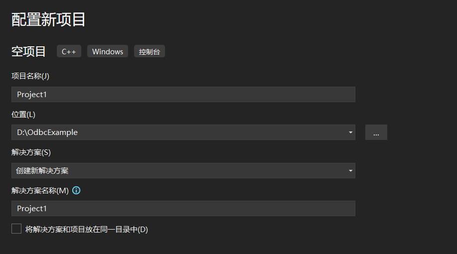
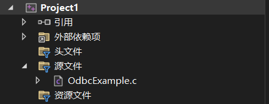

ODBC基本调用流程请参考官方文档[基本 ODBC 应用程序 - ODBC API Reference | Microsoft Docs](https://docs.microsoft.com/zh-cn/sql/odbc/reference/develop-app/basic-odbc-application-steps?view=sql-server-ver16)。

ODBC官方Demo见[C/C++ ODBC 应用程序访问 SQL 数据库 - ODBC Driver for SQL Server | Microsoft Docs](https://docs.microsoft.com/zh-cn/sql/connect/odbc/cpp-code-example-app-connect-access-sql-db?view=sql-server-ver16)。

## YashanDB ODBC驱动示例

本示例以visual studio作为工具进行编译和运行：

1. 创建一个新项目：

    

2. 创建OdbcExample.c文件：

    

3. 编写用户程序代码，如下：（YashanDB_Default_DSN为[安装说明](./ODBC安装说明/00ODBC安装说明)中已配置的ODBC数据源名称）

    ```c
    #include <windows.h>

    #include <sql.h>
    #include <sqlext.h>
    #include <stdio.h>
    #include <stdlib.h>
    #include <string.h>
    #include <assert.h>

    void HandleDiagnosticRecord(SQLHANDLE hHandle, SQLSMALLINT hType, RETCODE RetCode)
    {
        SQLSMALLINT iRec = 0;
        SQLINTEGER  iError;
        CHAR        wszMessage[1000];
        CHAR        wszState[SQL_SQLSTATE_SIZE + 1];

        if (RetCode == SQL_INVALID_HANDLE) {
            printf("Invalid handle!\n");
            return;
        }

        while (SQLGetDiagRec(hType, hHandle, ++iRec, wszState, &iError, wszMessage,
            (SQLSMALLINT)(sizeof(wszMessage) / sizeof(CHAR)), (SQLSMALLINT*)NULL) == SQL_SUCCESS) {
            // Hide data truncated..
            if (strcmp(wszState, "01004")) {
                printf("[%5.5s] %s (%d)\n", wszState, wszMessage, iError);
            }
        }
    }

    #define ODBC_TEST_CALL(yocFunc)                                             \
        do {                                                                    \
            SQLRETURN r = yocFunc;                                              \
            if (r == SQL_ERROR || r == SQL_NO_DATA_FOUND) {                     \
                HandleDiagnosticRecord(gTestHandles.hStmt, SQL_HANDLE_STMT, r); \
                return r;                                                       \
            }                                                                   \
        } while (0)

    #define CI_DATA_SOURCE "YashanDB_Default_DSN"

    typedef struct {
        SQLHENV  hEnv;
        SQLHDBC  hDbc;
        SQLHSTMT hStmt;
    } SQLHandles;

    SQLHandles gTestHandles;

    int main(int argc, char** argv)
    {
        if (SQLAllocHandle(SQL_HANDLE_ENV, SQL_NULL_HANDLE, &gTestHandles.hEnv) != SQL_SUCCESS) {
            printf("Unable to allocate an environment handle\n");
            return SQL_ERROR;
        }

        SQLSetEnvAttr(gTestHandles.hEnv, SQL_ATTR_ODBC_VERSION, (SQLPOINTER)SQL_OV_ODBC3, 0);

        if (SQLAllocHandle(SQL_HANDLE_DBC, gTestHandles.hEnv, &gTestHandles.hDbc) != SQL_SUCCESS) {
            printf("Unable to allocate an connection handle\n");
            return SQL_ERROR;
        }

        if (SQLConnect(gTestHandles.hDbc, CI_DATA_SOURCE, SQL_NTS, NULL, SQL_NTS, NULL, SQL_NTS) != SQL_SUCCESS) {
            printf("Unable to connect\n");
            return SQL_ERROR;
        }

        //或者可以使用有图形化界面的SQLDriverConnect代替SQLConnect连接
        // SQLCHAR driverConnStr[100] = "DSN=";
        // strcat(driverConnStr, CI_DATA_SOURCE);
        // strcat(driverConnStr, ";");

        // if (SQLDriverConnect(gTestHandles.hDbc, NULL, driverConnStr, SQL_NTS, NULL, 0, NULL, SQL_DRIVER_PROMPT) !=
        //     SQL_SUCCESS) {
        //     printf("Unable to Dirver connect\n");
        //     return SQL_ERROR;
        // }

        if (SQLAllocHandle(SQL_HANDLE_STMT, gTestHandles.hDbc, &gTestHandles.hStmt) != SQL_SUCCESS) {
            printf("Unable to allocate an connection handle\n");
            return SQL_ERROR;
        }

        // 简单的绑定入参和取数据
        // 以产品信息表product为例，遵循以下示例将获得product_no等于11001的product_name
        ODBC_TEST_CALL(SQLPrepare(gTestHandles.hStmt, "select product_name from product where product_no = ?", SQL_NTS));
        SQLINTEGER productNo = 11001;
        SQLLEN     indicator = sizeof(SQLINTEGER);
        ODBC_TEST_CALL(SQLBindParameter(gTestHandles.hStmt, 1, SQL_PARAM_INPUT, SQL_C_LONG, SQL_INTEGER, 0, 0, &productNo,
            indicator, &indicator));
        ODBC_TEST_CALL(SQLExecute(gTestHandles.hStmt));
        SQLCHAR productName[100];
        ODBC_TEST_CALL(SQLBindCol(gTestHandles.hStmt, 1, SQL_C_CHAR, &productName, 100, NULL));
        ODBC_TEST_CALL(SQLFetch(gTestHandles.hStmt));
        ODBC_TEST_CALL(SQLCloseCursor(gTestHandles.hStmt));  //此步骤为必须步骤，否则之后调用其他函数会返回SQL_ERROR
        printf("product_no %d's product_name is \"%s\"\n", productNo, productName);

        // 释放资源
        if (SQLFreeHandle(SQL_HANDLE_STMT, gTestHandles.hStmt) != SQL_SUCCESS) {
            printf("Unable to free stmt\n");
            return SQL_ERROR;
        }

        if (SQLDisconnect(gTestHandles.hDbc) != SQL_SUCCESS) {
            printf("Unable to disconnect\n");
            return SQL_ERROR;
        }

        if (SQLFreeHandle(SQL_HANDLE_DBC, gTestHandles.hDbc) != SQL_SUCCESS) {
            printf("Unable to free conn\n");
            return SQL_ERROR;
        }

        if (SQLFreeHandle(SQL_HANDLE_ENV, gTestHandles.hEnv) != SQL_SUCCESS) {
            printf("Unable to free env\n");
            return SQL_ERROR;
        }

        return SQL_SUCCESS;
    }
    ```

4. 生成解决方案。（请注意visual studio的解决方案配置中平台须为x64，调试属性中的字符集须为使用多字节字符集）

5. 执行解决方案，输出如下：

    ```shell
    D:\OdbcExample\Project1\x64\Debug>Project1.exe
    product_no 11001's product_name is "YashanDB"
    ```