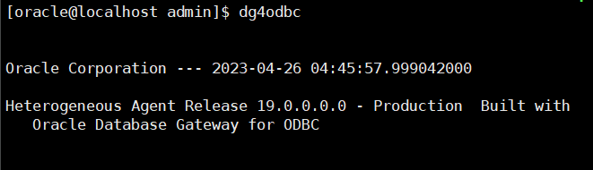

本章节将指导用户于Oracle数据库中配置DBLINK，并通过ODBC数据源连接至YashanDB数据库。用户须确保Oracle服务端和YashanDB ODBC驱动位于同一台机器上。

## 步骤1：配置YashanDB ODBC驱动

Oracle数据库配置DBLINK并连接至YashanDB数据库的操作需要使用ODBC驱动，可通过查看[ODBC驱动安装（Linux）](../ODBC安装说明/ODBC驱动安装（Linux）)自行安装和配置ODBC驱动。

## 步骤2：创建数据源

通过执行`vi /etc/odbc.ini`命令创建数据源，并写入如下内容，用户名、密码和服务器地址需要根据实际情况修改：

```sql
vi /etc/odbc.ini

[YASDBODBC]
Description  = YashanTest
Driver       = YashanDB
SERVER       = 127.0.0.1
PORT         = 1688
USER         = sys
PWD          = sys
```

## 步骤3：测试连接

通过执行`isql -v YASDBODBC`命令测试该数据源是否连接成功，如显示Connected则表示数据源连接成功。


## 步骤4：Oracle中配置DBLINK文件

通过执行`dg4odbc`命令检查dg4odbc驱动是否安装。



找到`initdg4odbc.ora`文件所在目录，执行以下命令：

```bash
cd /stage/hs/admin
touch initYASDBODBC.ora
vi /stage/hs/admin/initYASDBODBC.ora
 
HS_FDS_CONNECT_INFO = odbc_datasource_name #ODBC数据源名称，和/etc/odbc.ini中配置好的数据源名对应
HS_FDS_TRACE_LEVEL = off
HS_FDS_SHAREABLE_NAME = /usr/lib64/libodbc.so #当前环境libodbc.so所在位置，根据环境而定
HS_LANGUAGE = AMERICAN_AMERICA.AL32UTF8
HS_NLS_NCHAR = UCS2
 
SET ODBCINI= /etc/odbc.ini
#保存initYASDBODBC.ora文件
```

## 步骤5：配置监听文件

1. 于`/stage/network/admin/listener.ora`文件中新增如下内容：

```bash
SID_LIST_LISTENER =
  (SID_LIST =
    (SID_DESC =
      (SID_NAME = YASDBODBC) #与透明网关配置init*.ora文件名相同
      (ORACLE_HOME = /stage) #当前环境ORACLE_HOME路径
      (PROGRAM = dg4odbc)
    )
  )
```

2. 于`/stage/network/admin/tnsnames.ora`文件中新增如下内容：

```bash
#tns名与透明网关配置init*.ora文件名相同
YASDBODBC =
  (DESCRIPTION =
    (ADDRESS_LIST =
      (ADDRESS = (PROTOCOL = TCP)(HOST = localhost)(PORT = 1521))
    )
    (CONNECT_DATA =
      (SERVICE_NAME = YASDBODBC) #与透明网关配置init*.ora文件名相同
    )
    (HS = OK)
  )
```

## 步骤6：重启监听

通过执行如下命令对Oracle监听进行重启：

```bash
lsnrctl stop
lsnrctl start
lsnrctl status
```

重启之后可看到YASDBODBC的实例被监听，且状态为unknown。


通过执行如下命令查看YASDBODBC的监听服务是否开启：

```bash
tnsping YASDBODBC
```


## 步骤7：创建DBLINK

执行如下命令于Oracle数据库中创建DBLINK，用户名及密码需要根据实际情况修改：

```sql
DROP DATABASE link dblink_name; -- dblink_name自行指定
CREATE DATABASE link dblink_name CONNECT TO "sys" IDENTIFIED BY "sys" USING 'YASDBODBC'; -- USING后跟的名字与透明网关配置init*.ora文件名相同
```

## 步骤8：测试DBLINK

通过如下命令测试DBLINK是否配置成功，查询成功代表dblink配置成功：

```sql
SELECT USERNAME,STATUS,TYPE FROM V$SESSION@dblink_name;
```

如果需要在sqlplus验证DBLINK中文支持，需要设置oracle NLS_LANG客户端字符集同终端一致，例如：

```bash
export NLS_LANG=american_america.AL32UTF8
```

## 查看日志

如需跟踪ODBC行为，可执行如下语句：

```bash
vi /etc/odbcinst.ini
```

新增内容，TraceFile为输出的文件路径：

```bash
[ODBC]
TraceFile = /home/odbcsql.log
Trace = Yes
```

修改initYASDBODBC.ora中的HS_FDS_TRACE_LEVEL = debug。