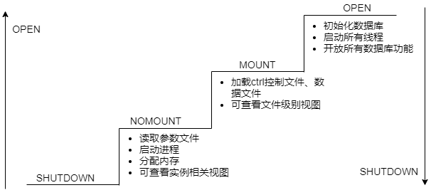

## 数据库实例阶段

数据库实例从关闭启动到正常使用，要经过NOMOUNT、MOUNT和OPEN三个阶段。

*   **NOMOUNT**：启动数据库实例，此时读取参数文件，但不加载数据库，仅允许sys用户登录。

*   **MOUNT**：启动数据库实例，读取控制文件，加载数据库，但数据库处于关闭状态。

*   **OPEN**：启动数据库实例，加载并打开数据库。打开数据库时还可以按需选择[打开模式](#open_mode)。



## 启动数据库实例

- yasboot工具：YashanDB支持通过yasboot工具将数据库实例调整至任意阶段。

- SQL语句：YashanDB支持通过ALTER DATABASE语句将数据库实例从NOMOUNT阶段调整到MOUNT阶段或OPEN阶段，但ALTER DATABASE语句仅对语句执行实例生效。

本文主要介绍启动单机部署和分布式部署的实例，如需了解共享集群的实例启动请查阅[共享集群启停](../../共享集群/集群服务管理/共享集群启停)。

### 启动到NOMOUNT阶段

只能使用yasboot工具将数据库实例启动到NOMOUNT阶段，命令如下：

```shell
# 方式一：先关闭然后启动数据库集群至NOMOUNT阶段
$ yasboot cluster stop -c yashandb
$ yasboot cluster start -c yashandb -m nomount
# 方式二：一键重启数据库集群至NOMOUNT阶段
$ yasboot cluster restart -c yashandb -m nomount

# 启动group_id为1的节点组至NOMOUNT阶段
$ yasboot group start -c yashandb -g 1 -m nomount
# 启动node_id为4-1的节点至NOMOUNT阶段
$ yasboot node start -c yashandb -n 4-1 -m nomount
```

数据库实例启动到NOMOUNT阶段后，查看V$INSTANCE视图的STATUS字段值为STARTED。

```sql
$ yasql sys/********@192.168.1.2:1688

SQL> SELECT status FROM V$INSTANCE;
 
STATUS   
---------
STARTED 
```

### 启动到MOUNT阶段

- yasboot工具：可以将数据库实例从任意阶段调整至MOUNT阶段。

- SQL语句：ALTER DATABASE语句可以将数据库实例从NOMOUNT阶段调整至MOUNT阶段。

命令/语句如下：

```shell
# yasboot工具：
# 方式一：先关闭然后启动数据库集群至MOUNT阶段
$ yasboot cluster stop -c yashandb
$ yasboot cluster start -c yashandb -m mount
# 方式二：一键重启数据库集群至MOUNT阶段
$ yasboot cluster restart -c yashandb -m mount

# 启动group_id为1的节点组至MOUNT阶段
$ yasboot group start -c yashandb -g 1 -m mount
# 启动node_id为4-1的节点至MOUNT阶段
$ yasboot node start -c yashandb -n 4-1 -m mount

# SQL命令（此时须确保数据库实例处于NOMOUNT阶段）：
$ yasql sys/********@192.168.1.2:1688

SQL> ALTER DATABASE MOUNT;
```

数据库实例启动到MOUNTED阶段后，查看V$INSTANCE视图的STATUS字段值已更新为MOUNTED。

```shell
$ yasql sales/********@192.168.1.2:1688

SQL> SELECT status FROM V$INSTANCE;
 
STATUS   
---------
MOUNTED 
```

<span id="open_mode" name="open_mode" class="yaslink"></span>
### 数据库的打开模式

YashanDB准备从MOUNT或NOMOUNT阶段调整至OPEN阶段时，可以通过SQL语句根据不同场景配置数据库的打开模式为READWRITE、RESETLOGS或UPGRADE，语法为`ALTER DATABASE OPEN [READWRITE|RESETLOGS|UPGRADE]`。

*   READWRITE：用于正式生产环境，数据库完整事务的读写操作；数据库打开时如果不设置打开模式参数，则默认为READWRITE。

*   RESETLOGS：用于数据库发生故障时，如果需要进行不完全恢复操作，请使用RESETLOGS模式打开数据库，打开后将重新设置日志号。

  > **Caution**：
  >
  > 若执行完全恢复操作时使用RESETLOGS模式打开数据库，会报YAS-02184错误并关闭实例。

*   UPGRADE：用于打开数据库升级模式，该模式下不允许建立新的会话连接。

### 启动到OPEN阶段

- yasboot工具：可以将数据库实例从任意阶段调整至OPEN阶段。

- SQL语句：ALTER DATABASE语句可以将数据库实例从NOMOUNT或MOUNT阶段调整至OPEN阶段，同时可以按需选择[打开模式](#open_mode)。

命令/语句如下：

```shell
# yasboot工具：
# 方式一：先关闭然后启动数据库集群至OPEN阶段
$ yasboot cluster stop -c yashandb
$ yasboot cluster start -c yashandb -m open
# 方式二：一键重启数据库集群至OPEN阶段
$ yasboot cluster restart -c yashandb -m open

# 启动group_id为1的节点组至OPEN阶段
$ yasboot group start -c yashandb -g 1 -m open
# 启动node_id为4-1的节点至OPEN阶段
$ yasboot node start -c yashandb -n 4-1 -m open

# SQL命令（此时须确保数据库实例处于NOMOUNT或MOUNT阶段）：
$ yasql sales/********@192.168.1.2:1688

SQL> ALTER DATABASE OPEN;
```

数据库实例启动到OPEN阶段后，查看V$INSTANCE视图的STATUS字段值已更新为OPEN。

```shell
$ yasql sales/********@192.168.1.2:1688

SQL> SELECT status FROM V$INSTANCE;
 
STATUS   
---------
OPEN 
```

可通过数据库V$DATABASE视图查看数据库打开模式。

```sql
SELECT database_id,database_name,open_mode FROM V$DATABASE;
 
    DATABASE_ID DATABASE_NAME    OPEN_MODE       
--------------- ---------------- -----------------
      569377301 yasdb            READ_WRITE   
```

主备部署时，还需关注主备角色的DATABASE_ROLE字段。

```sql
SELECT DATABASE_NAME,LOG_MODE,OPEN_MODE,PROTECTION_MODE,DATABASE_ROLE,BLOCK_SIZE,STATUS FROM  V$DATABASE;
  
DATABASE_NAME LOG_MODE    OPEN_MODE   PROTECTION_MODE      DATABASE_ROLE  BLOCK_SIZE STATUS
------------- ----------- ----------- -------------------- ------------- ----------- -------
yasdb         ARCHIVELOG  READ_ONLY   MAXIMUM PERFORMANCE  STANDBY              8192 NORMAL
```

### 启动实例失败场景

#### 环境变量未设置或错误

以下为YashanDB实例成功启动的三个关键环境变量，设置错误将导致无法启动到NOMOUNT及之后阶段，请根据实际情况将环境变量调整至正确值：

- YASDB_HOME：YashanDB默认软件目录

- YASDB_DATA：YashanDB默认数据目录

- LD_LIBRARY_PATH：YashanDB依赖包目录，使用yasboot sql或yaql前必须先正确配置该环境变量

#### 控制文件验证失败

YashanDB在实例启动时进行控制文件校验，出现如下情况时，实例将无法启动到MOUNT及之后阶段：

- **控制文件实际路径与CONTROL_FILES参数配置路径不一致**

  出现此种情况时，解决方法如下：

  - 方法一：修改控制文件路径。

  - 方法二：启动实例到NOMOUNT阶段后修改CONTROL_FILES参数，再重新启动实例。

- **控制文件中的数据库版本与实例版本不一致**

  此种情况启动实例将提示*database version x.x.x incompatible with YashanDB version x.x.x*错误，请根据实际情况选择是否进行版本升级。

- **控制文件组成员的数据库ID不一致**

  此种情况通常出现在1台服务器上存在多个数据库实例的场景，CONTROL_FILES参数配置了不同数据库的控制文件，将其修改为正确的控制文件路径即可。

#### 数据文件丢失或损坏

- **内置表空间数据文件丢失或损坏**

  如出现内置表空间数据文件丢失或损坏的情况，实例将无法启动到MOUNT及之后阶段。

  此种情况下，通常可以通过[恢复](../备份恢复/00备份恢复)最新的可用备份集解决，若不存在备份集则只能通过找回文件、物理恢复等方式解决。

- **用户数据文件丢失或损坏**

  当用户表空间挂载的数据文件出现丢失或损坏时，通常可以通过[恢复](../备份恢复/00备份恢复)最新的可用备份集解决，若不存在备份集则可通过YashanDB提供的逃生通道进行应急处理，保证数据库能正常启动、打开和运行，具体操作请查阅[数据文件损坏后的应急处理](../文件管理/数据文件管理.html#EH)。

#### redo文件丢失或损坏

如出现redo文件丢失或损坏的情况，实例将无法启动到MOUNT及之后阶段。

此种情况下，可通过[恢复](../备份恢复/00备份恢复)最新的可用备份集解决。

#### 相关进程未启动

使用yasboot工具调整数据库实例时须确保yasom和yasagent进程处于开启状态，否则将提示*connect： connection refused*错误。

服务器重启时，yasom和yasagent进程会自动关闭，可通过注册开机自启动功能于服务器重启时自动拉起yasom和yasagent进程，具体操作请查阅[配置开机自启动](../../安装和升级/安装部署/安装后初始环境/配置开机自启动)。

## 关闭数据库实例

- yasboot工具：YashanDB支持通过yasboot工具关闭数据库实例。

- SQL语句：YashanDB支持通过SHUTDOWN语句关闭数据库实例，但SHUTDOWN语句仅对语句执行实例生效。

本文主要介绍关闭单机部署和分布式部署的实例，如需了解共享集群的实例关闭操作请查阅[共享集群启停](../../共享集群/集群服务管理/共享集群启停)。

### 关库模式

YashanDB支持按以下3种模式关闭数据库实例：

*   NORMAL：等待事务正常结束后关闭数据库，没有等待时间限制，建议选择该模式关闭数据库。

*   IMMEDIATE：强制中断所有数据库操作，将未完成的事务回退，等待脏页刷盘后关闭数据库。

*   ABORT：强制中断所有数据库操作并关闭数据库，不等待脏页刷盘。这种关闭模式不等待脏页刷盘，会使启动时间变长。

  > **Caution**：
  >
  > 仅当服务器宕机、断电或人为强制关库时才建议使用ABORT模式，否则应避免使用该模式。

### 关闭操作

yasboot工具和SQL语句均可以按指定模式关闭数据库实例，命令/语句如下：


```shell
# yasboot工具：
# 可使用-s参数指定关库模式，省略则默认为IMMEDIATE
$ yasboot cluster stop -c yashandb
$ yasboot cluster stop -c yashandb -s normal
$ yasboot cluster stop -c yashandb -s immediate
$ yasboot cluster stop -c yashandb -s abort

# 关闭group_id为1的节点组
$ yasboot group stop -c yashandb -g 1
# 关闭node_id为4-1的节点
$ yasboot node stop -c yashandb -n 4-1 -s normal

# SQL语句：
# 使用关键字指定关库模式，省略则默认为NORMAL
$ yasql sales/********@192.168.1.2:1688

SQL> SHUTDOWN NORMAL;
SQL> SHUTDOWN IMMEDIATE;
SQL> SHUTDOWN ABORT;
```