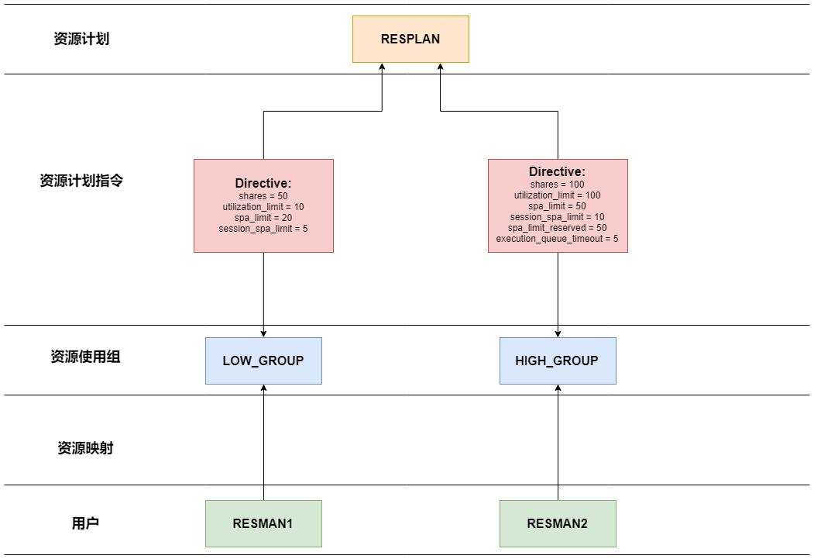

YashanDB资源管理通过配置物理资源（CPU、内存等）的分配规则，以满足不同用户或程序对资源的需求。通过资源管理，可以实现如下目标：

- 提供资源隔离能力，即使在极端场景下也能使用到自己配额内的资源，不受其他用户的影响；
- 保证数据库在稳定运行的前提下，最大限度地提高整体资源利用率；
- 允许配置并切换使用不同的资源使用计划，例如不需要重启情况下，切换适合白天和晚上的计划；
- 实时监控物理资源分配和使用情况。

## 核心概念

### 资源使用组

资源使用组由资源使用者组成，同一资源使用组内的资源使用者共用一份资源计划指令。

系统包含如下默认资源使用组：

- SYS_GROUP：包括系统用户sys和系统进程。

- DEFAULT_CONSUMER_GROUP：不存在资源映射关系的资源使用者默认划分至该组。

创建会话时，YashanDB会根据用户的资源映射关系自动将其划分至相应资源使用组中。数据库管理员可以通过修改用户的资源映射关系调整该用户的新会话所属资源使用组。

### 资源映射

资源映射是指将资源使用者加入至资源使用组中，资源使用者以用户（USER）为维度。

资源使用组与资源使用者为一对多关系，即一个资源使用者只能加入一个资源使用组但一个资源使用组可以包含多个资源使用者。

### 资源计划

资源计划是对环境中每个节点物理资源（例如CPU）的分配计划，通过激活特定的资源计划来指定如何为资源使用组分配资源。

系统包含如下默认资源计划：

- TOALL: 一级资源计划，包含子计划SYS_GROUP和DEFAULT_CONSUMER_GROUP的资源计划指令。

- SYS_GROUP：二级资源计划，属于TOALL的子计划，包含关联系统用户sys和系统进程的资源计划指令。

通过切换不同的资源计划，能够为所有资源使用组切换对应的资源计划指令。

### 资源计划指令

资源计划指令描述了资源使用组在不同计划中对物理资源的分配规则。

资源计划与资源计划指令为一对多关系，即每个资源组在一个资源计划中只能指定一个资源计划指令。

## 资源类型

YashanDB资源管理通过对物理资源配置分配规则，以满足不同用户或程序对资源的需求。目前支持的资源类型有内存和CPU，具体介绍请查阅[资源类型](资源类型)。

## 配置资源管理

YashanDB资源管理通过内置高级包[DBMS_RESOURCE_MANAGER](../../开发手册/PL参考手册/内置高级包/DBMS_RESOURCE_MANAGER)和相关配置参数提供对物理资源的配置能力，具体介绍请查阅[配置资源管理](配置资源管理)。

### RSRC\_MODE

YashanDB通过`RSRC_MODE`的配置参数来控制单个或多个物理资源是否启用资源管理能力，具体介绍请参阅[配置参数](../../参考手册/配置参数)。

该配置参数修改后，需要重启实例才能生效。

### RESOURCE\_MANAGER\_PLAN

YashanDB通过`RESOURCE_MANAGER_PLAN`的配置参数来指定如何为资源使用组分配物理资源，具体介绍请参阅[配置参数](../../参考手册/配置参数)。

### RSRC\_QUEUE\_OPERS

YashanDB通过`RSRC_QUEUE_OPERS`的配置参数来指定资源密集型SQL的类型，执行这些SQL的会话将受到调度管控，具体介绍请参阅[配置参数](../../参考手册/配置参数)。