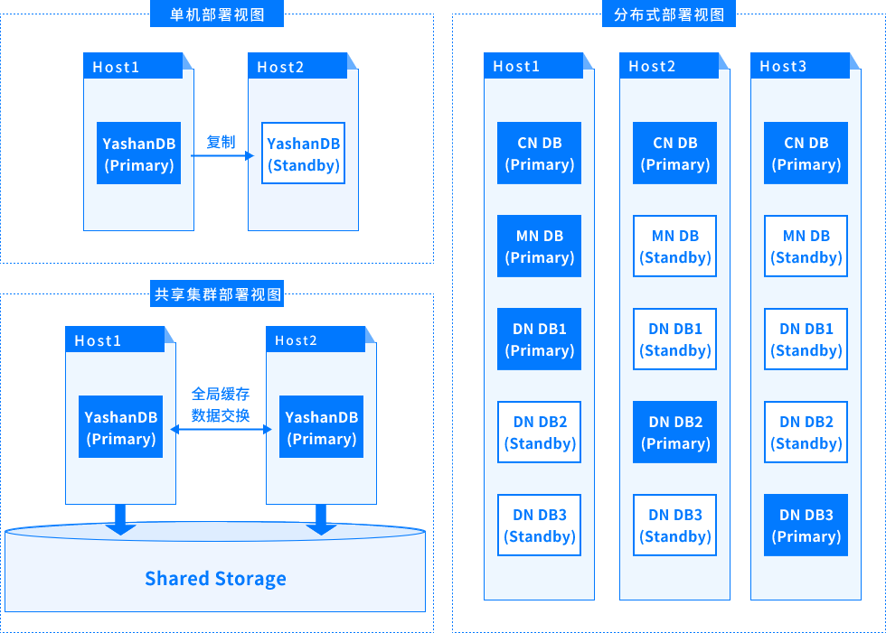
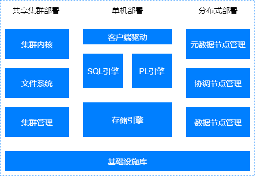

## 部署架构

YashanDB支持三种部署形态，分别是**单机（主备）部署**（简称：单机部署）、**共享集群部署**和**分布式集群部署**（简称：分布式部署）。

### 单机部署

单机部署一般会在两台服务器上分别运行主实例和备实例，通过主备复制实现主库的修改同步到备库，也有一些场景对高可用要求较低，部署时只使用一台服务器仅运行一个实例。

单机部署是比较常见的形态，适用于大多数场景。

### 共享集群部署

共享集群在硬件层面需要依赖共享存储，所有实例均可读写，实例之间通过全局缓存实现数据交换。

共享集群部署常应用于对多实例数据库集群多写、高可用、性能以及可扩展能力均有较高要求的高端核心交易场景。

### 分布式部署

分布式部署中有更多不同类型的程序，包括MN组、CN组和DN组，同一服务器上可以同时运行多种不同类型的程序。

分布式部署适用于对处理能力要求较高且有较强线性扩展诉求的场景，例如海量数据分析业务场景。

## 逻辑架构

YashanDB的逻辑架构零层视图如下图所示：

### 单机主要子系统

**客户端驱动**

包括一系列客户端API，提供包括建立连接，执行SQL语句，获取结果集等一系列能力。

**SQL引擎**

SQL引擎包括解析器、优化器、执行器，负责客户端提交SQL文本的解析，生成执行计划，以及具体执行。SQL引擎提供丰富的内置函数库，方便在SQL中直接使用函数做表达式运算。

**PL引擎**

PL引擎提供用户自定义函数、类型管理，自定义类型等能力，包括高级包、存储过程、存储函数、触发器等。PL对象可持久化，创建后可以多次执行。

**存储引擎**

负责存储空间管理，采用段区页三级空间管理；负责事务管理，并控制并发访问，提供一致性访问能力；负责关系对象的管理，包括表、索引等。

### 共享集群主要子系统

在单机形态基础上，共享集群部署形态中新增了共享集群内核、文件系统和共享集群管理三个子系统：

**共享集群内核**

共享集群部署形态中集群运行时的核心组件，通过聚合内存技术负责各服务器运行期内存页面的协调，确保集群多实例高效实现一致性的访问。

**文件系统**

负责管理存储设备，提供类文件系统接口给数据库使用，处理上层应用的文件读写请求，经过地址转换转化为对存储设备的读写操作。

**共享集群管理**

共享集群部署形态中负责管理集群，提供配置管理能力。

### 分布式主要子系统

在单机形态基础上，分布式部署形态中新增了元数据节点管理、协调节点管理和数据节点管理三个子系统：

**元数据节点管理**

负责分布式集群的节点管理服务、元数据管理服务和全局时钟服务。

**协调节点管理**

负责处理客户端的连接请求，SQL命令请求，生成分布式执行计划，然后分发到数据节点执行，最后将执行结果汇总返回给客户端。

**数据节点管理**

负责持久化数据，以及执行分解后的SQL执行计划。

### 公共基础设施库

基础设施库中是常用的公共基础能力，包括网络通讯、线程管理等。

## 实例架构

YashanDB包括数据库和实例两个概念，数据库和数据库实例（简称“实例”）。数据库和数据库实例一般是一对一关系，但在共享集群部署中，数据库与数据库实例是一对多关系，更多详情请查阅[部署架构](#deploy)。

- 数据库

    数据库指存放在非易失存储上的一组数据文件，包括控制文件、数据文件和日志文件。若这些数据文件缺失或损坏，数据库实例将无法正常启动和运行。

- 数据库实例

    数据库实例仅在运行期存在，它包括一组内存结构和一个多线程程序，更多详情请查阅[实例架构](../实例架构/数据库实例)。

通常情况下，我们会用“数据库”同时指代上述两个概念。