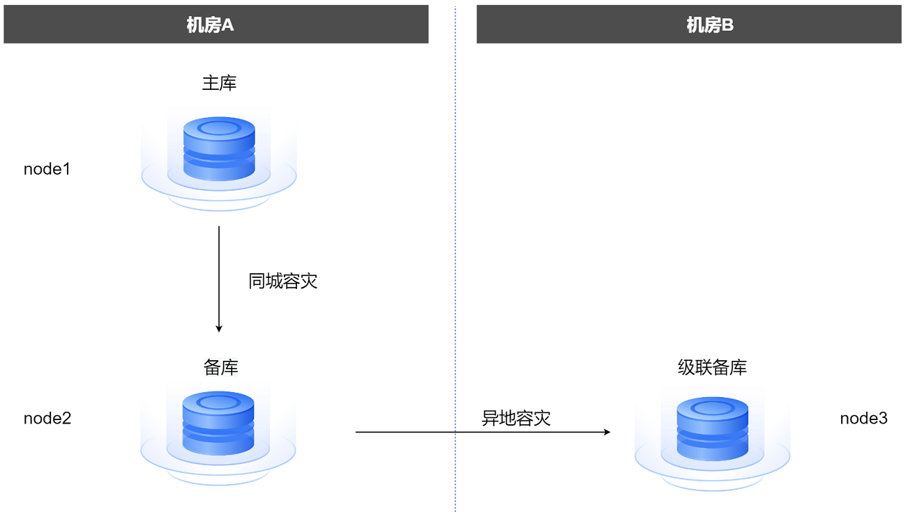
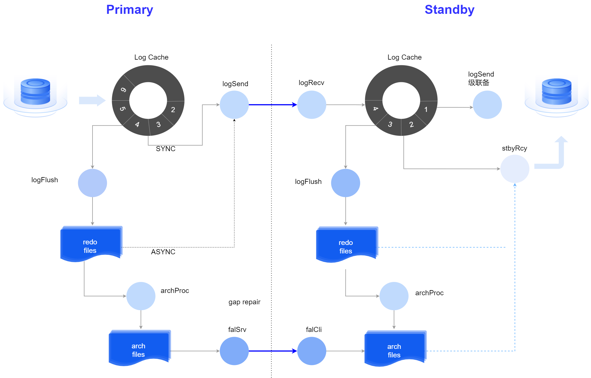

主备复制是数据库最主要的高可用措施，通过将主库上的数据实时复制到备库来实现。主库是执行业务的数据库实例，备库是复制主库数据的数据库实例。当主库发生故障时，业务可以转移到备库上继续执行，降低故障对业务的影响，提高数据库的可用性。

## 主备部署架构

YashanDB支持主备模式（一主多备）和级联备模式（不限层级）的高可用部署架构。

主备实例部署在不同的服务器上，多台服务器一般应连接到同一交换机，确保网络低时延，并应考虑交换机的冗余配置，保证高可用避免单点故障。

级联备为异步备库，从备库接收日志，减少主库上的带宽负载，通常用于异地容灾中。

以下图为例：

- **主库**

    当前提供在线数据库服务，读写模式。

    主备集群部署中，主库被扩展为主集群的概念，主集群中多实例同时提供在线数据库服务，均为读写模式。

    分布式高可用部署中，每个MN Group和DN Group组内包含一个主库。

- **备库**

    从主库接收日志并回放，只读模式，主库故障时从备库状态切换为主库状态，一个主库可以有多个备库。

    单机主备高可用部署中，根据主备复制方式的不同，备库又可分为物理备库和逻辑备库。

    主备集群部署中，备库被扩展为备集群的概念，但只需要备集群中的1号实例进行日志接收和回放。

    分布式高可用部署中，每个MN Group和DN Group组内包含一个或多个备库。

- **级联备**

    备库的备库，从备库接收日志并回放，一个备库可以有多个和多层级联备。当上级备库升为主库后，级联备转为普通备库；当主库变成备库后，它的备库变成级联备。

    主备集群部署和分布式高可用部署中无级联备。

## 主备复制链路

主备复制中，通过主库发送redo日志，备库接收日志并回放，以实现备库和主库的在线同步。YashanDB采用环形Log Cache缓存redo日志，同步模式下日志发送和备库回放优先从缓存读取数据，提高速度。

日志回放是指备库通过重演主库发送过来的redo日志来恢复数据页面，以达到和主库的及时同步。当在Log Cache和redo文件中均未找到需要的数据时，将启动线程同步主库的归档日志文件到备库并从中查找所需数据，最大程度保障主备库的数据一致性。

主备库复制链路：

主备集群复制链路：

## 主备切换

YashanDB支持手动切换主备库和特定场景下无需外部干预的自动选主。

- **手动切换**

    支持Switchover（主备库同步正常的情况）和Failover（主库数据库损坏，或者由于系统损坏导致主库不可用的情况）两种模式的手动切换，更多详情请查阅[主备切换](../高可用/主备复制及切换.html#switch)。

- **自动选主**

    根据不同的部署形态，YashanDB实现了不同机制的自动选主，包括主备自动选主和yasom仲裁选主，降低运维复杂度。当主库发生异常不能对外服务时，系统根据相应的机制在备库中选出新的主库并自动执行主备切换，更多详情请查阅[自动选主](../高可用/自动选主)。
