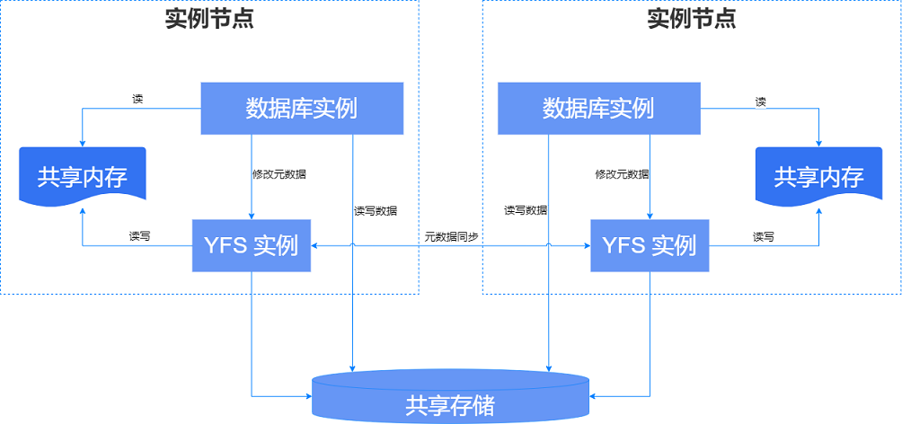

崖山文件系统YFS是YashanDB的专用并行文件系统，提供存储设备管理、存储高可用、文件系统接口等功能。

共享集群中每一个服务器上运行的一组YFS相关线程称为一个YFS实例，YFS实例与YCS实例运行在同一进程（YCS进程）中。生产环境下，通常每台服务器只会运行一个YFS实例。

数据库服务端核心进程YASDB是YFS实例的客户端（Client），只与同服务器的YFS实例通信。YASDB进程通过Unix Domain Socket向YFS实例发起元数据变更请求，YFS实例更新共享内存中的元数据缓存，并将元数据变更持久化到共享存储。YASDB进程读取共享内存中的元数据，直接对磁盘进行读写，无需通过YFS实例，IO性能接近直接读写裸设备。

YFS实例管理全局存储元数据，通过事务保证操作的原子性，各YFS服务之间通过网络同步元数据，通过一致性协议保证全局一致性，确保YFS各实例看到的文件状态没有差别。

## 磁盘管理

YFS具备磁盘管理能力，将磁盘裸设备（disk）划分为磁盘组、故障组等逻辑概念，以层级结构管理。

### 磁盘组（DiskGroup）

磁盘组（DiskGroup）是YFS管理磁盘设备的最顶层逻辑单元，一个DiskGroup应该至少包含1个FailureGroup。

YFS中可能存在多个DiskGroup，各DiskGroup分别管理一些disk，各DiskGroup之间资源隔离、故障隔离。

不同DiskGroup可以执行差异化存储管理，指定不同规格，例如为不同DiskGroup配置不同的副本数。

每个DiskGroup的属性在创建时指定，一旦创建不可更改。DiskGroup的主要属性包括冗余度（Redundancy Level，也叫冗余级别）和分配单元大小（AU size）。

### 故障组（FailureGroup）

YFS将有可能同时故障的disk划分为故障组FailureGroup，配合“多副本”实现数据（包括元数据以及文件数据）冗余，支持存储高可用。

每个FailureGroup包含一个或多个disk，它们可能是：

- 同一磁阵中一些LUN

- 同一机柜的磁盘

- 同一电源供电的多个存储设备

- 同一机房的多个存储设备

FailureGroup没有绝对的划分标准，而是在特定的运维条件下根据各disk故障概率的相关性，将它们进行适当分组，确保不同的FailureGroup（大概率）不会同时故障。

YFS会从每个故障组中各选一个磁盘将其组成伙伴磁盘集，可通过[V\$YFS_DISK](../../参考手册/系统视图/动态视图/V$YFS_DISK)视图的`PARTNERS`字段获取磁盘的伙伴关系。

> **Note**:
>
> 从diskgroup中增、删disk后，各磁盘的伙伴关系可能发生变化。

### 磁盘设备（Disk）

YFS的所有数据都按指定策略保存在disk上，包括YFS自身的元数据、YFS文件以及目录的元数据、用户数据等。

一个最小可用的YFS需要以下两个disk：

- 1个BOOT_DISK：用于存储YFS自身元数据，建议容量500MB以上。YFS依赖该disk完成启动和初始化，用户可在YFS配置中指定该磁盘。

- 1个用户数据disk：即YFS的数据盘，可以配置多个数据盘，用于保存用户数据，需在创建磁盘组时指定。

YFS仅支持Direct IO模式读写，加入YFS的磁盘至少应支持块大小512B - 64MB的DIO模式读写。同一个磁盘不能在YFS中复用，可能丢失数据。

### 存储高可用

在创建DiskGroup时，可以通过指定冗余度配置该DiskGroup的副本数。数据副本会保存在不同的FailureGroup中，只要至少一个副本完整，数据便可用。

不同FailureGroup下的disk之间故障是独立事件，同时故障的概率极低，因此数据损坏的概率极低，保证了数据高可用。

#### 多副本

副本数指数据保存的份数，例如1副本表示YFS中只存在1份数据，3副本表示YFS中存在3份相同的数据。

副本数具体可分为用户数据副本数和YFS元数据副本数。在FailureGroup数大于数据副本数时，系统会自动为元数据创建更多副本，进一步加强YFS的可靠性。

使用多副本保护数据的前提是正确规划FailureGroup，确保数据副本之间故障概率独立：

- 所有副本应分布在不同的FailureGroup，因此需满足`FailureGroup个数 >= 用户数据副本数`。

- 各冗余级别下YFS元数据副本数是推荐值，如果FailureGroup数量小于元数据副本数要求，元数据副本数将被调整为与FailureGroup数量相同的值。

YFS将同一数据的N个副本分别保存在同一组伙伴磁盘中的N块磁盘上，有效保证各副本完全隔离位于不同的FailureGroup中。如果某个disk及其同组伙伴磁盘总数小于磁盘组冗余度所需副本数，那么该组磁盘视为不可用，需增加disk或FailureGroup使该组磁盘总数达到副本数才能使用。

> **Note**：
>
> YFS中数据的多副本不能跨越DiskGroup，因为各DiskGroup的资源是完全隔离的。

#### 冗余度（Redundancy）

YFS支持3种冗余级别：

- EXTERNAL：该级别表示无数据冗余，用户数据副本数为1，YFS元数据副本数为1。配置本级别的情况下，数据的可靠性依赖外部能力实现，例如RAID。

- NORMAL：一般级别的数据冗余，用户数据副本数为2，YFS元数据副本最小为2，最大为3。

- HIGH：高级别的数据冗余，用户数据副本数为3，YFS元数据副本数最小为3，最大为5。

#### 分配单元（Allocate Unit）

YFS将disk划分为等大小的分配单元（AU，Allocate Unit）进行管理，AU size是YFS分配磁盘空间的最小单元。

YFS支持的AU size颗粒度有：1M（默认值）、4M、8M、16M、32M，用户可以在创建DiskGroup时指定该DiskGroup的AU size，或使用默认的AU size。

AU size决定了YFS管理磁盘空间的颗粒度，更大的AU size可以使YFS创建更大的文件、获得更好的连续IO性能，但也会消耗更多内存，浪费一些磁盘空间。用户应根据业务特征选择合适的AU size，不合适的AU size可能影响YFS的运行性能。对AU size的配置建议如下：

- 系统中以小文件为主时，建议选择较小的AU size。

- 系统中以大文件为主时，建议选择较大的AU size。

- 当AU size大于等于绝大多数IO size时，可以获得更好的性能。

## 文件及目录管理

YFS提供了一组文件操作API，抽象底层存储管理细节，语义兼容大多数文件系统操作，具备文件、目录、路径等文件系统基本概念。

YFS还提供专用的管理终端yfscmd，提供与Linux Shell类似的文件管理界面，例如常见的cd、ls、mv、cp等命令。

### 目录

YFS以目录树的形式组织、管理文件。YFS的路径构成为`+DG_NAME/DIR/PATH/file.name`。

YFS的根是`+`，一级目录是磁盘组的名称，其他次级才是一般意义上的目录和文件名。磁盘组目录是虚拟目录，无法直接增/删/改，需通过增/删磁盘组间接修改。

可以通过绝对路径中的根识别文件系统类型，以`+`开头的是YFS路径，以`/`开头的是系统本地路径。yfscmd cp指令通过根路径字符识别文件所在文件系统，实现YFS和本地文件系统的交叉复制。

### 文件

YFS文件除用户数据外，还包含一些精简的属性信息，例如创建时间、文件大小等。由于YFS仅支持Direct IO读写，YFS文件大小都是512字节的整倍数。

文件实际占据的磁盘空间可能大于文件大小，约为`Round(FileSize/AuSize) * Redundancy`，文件的元数据也会额外占据一些空间，但相对较少。