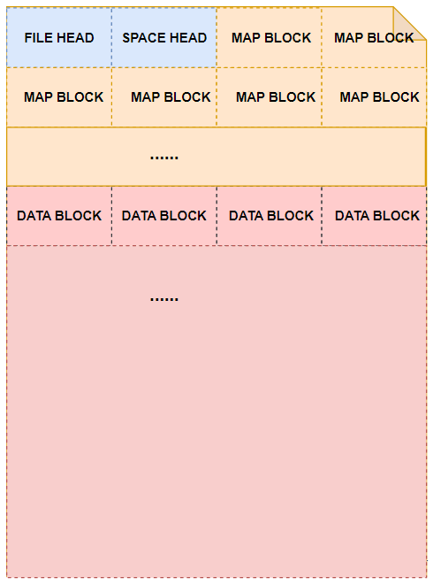
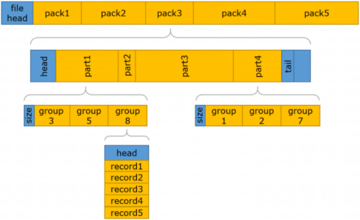

物理存储结构用于承载YashanDB在存储介质上持久化数据（包括用户数据以及数据库元数据），用户可以直接在操作系统层面查看物理储存结构相关的文件。

YashanDB物理存储结构主要包括以下文件：

- **数据存储文件**：用于存储数据的物理文件，YashanDB支持段页式和分片式两种不同组织格式的数据文件。

- **临时文件**：用于临时数据（临时表空间的数据）的存储或中间计算结果的换出（交换表空间的数据）。

- **redo重做日志文件**：用于记录数据库变更的物理日志，通常用于故障恢复或主备同步。

- **控制文件**：用于持久化数据库基本元数据的文件，例如其他物理文件的信息，是加载数据库的入口。

- **双写文件**：用于数据的多副本写入，解决因文件系统缓存导致的数据块半写问题。

YashanDB支持将物理存储结构部署到不同的存储介质上，主要包括：

- 通用文件系统：YashanDB支持将物理存储结构部署到主流的文件系统上，例如ext4、XFS、ZFS、NFS等。

- 自研文件系统：YashanDB自研文件系统YFS除了基本的物理文件存储能力之外，还提供多实例共享存储的能力。

- 云存储：YashanDB支持将数据以对象存储的方式存储到远端，例如S3、OBS、BLOB等。

## 数据存储文件

YashanDB支持行式和列式两种不同的数据存储格式，对应段页式和切片式两种不同格式的数据存储文件，分别为数据文件（DataFile）和切片文件（SliceFile）。

### 数据文件

数据文件在创建表空间时指定，每个表空间至少要包含一个数据文件。数据文件存储的数据不仅包括用户的数据，也包括数据库元数据（例如表的结构信息）、历史数据（undo数据）等。

虽然Linux稀疏文件（只更新元数据不实际占用存储空间）的方式可以极大程度的提高文件创建效率，但会出现数据库运行过程中因为实际存储空间不足导致的异常，因此YashanDB创建数据文件时会使用预占空间的方式，同时会初始化所有存储空间，并通过自适应并行技术来加速创建的过程。

YashanDB支持数据文件的各类运维SQL语句（包括创建、删除、属性修改、脱机等），但不允许从物理上直接操作数据文件（例如使用操作系统的rm、mv、chmod等命令），否则会导致数据库出现预期外的异常。

段页式空间管理依赖于基于数据文件的物理存储方式，因此数据文件在物理上也是被划分成了数据块，YashanDB支持的数据块大小8K、16K和32K。例如数据文件的大小为1M，数据块的大小为8K，那么这个数据文件就包括连续的128个数据块。

数据文件中存在多种不同用途的数据块，主要包括：

- 表空间头：用于记录所属表空间的相关信息。

- 数据文件头：用于记录当前数据文件的相关信息。

- 空间管理块：用于当前数据文件的空间管理，记录了每个数据块的使用情况。

- 数据块：实际用于存储数据的数据块。

### 切片文件

切片文件用于存储LSC表的稳态切片数据，采用文件存储，用户可以指定存储在databucket中。切片文件由列数据文件、列元数据文件和切片元数据文件组成：

- 列数据文件：数据按固定行数，被分为多个block，多个block组成一个extent，每一列相同位置的block被称为RowGroup。

- 列元数据文件：存储block、extent的元数据，包含block最大最小值的zone map和一些其他的统计信息，若是字典编码，还会存储字典。

- 切片元数据文件：主要存储整个slice的列数量，crc列存储位置等信息。

### 临时文件

临时文件用于存储非持久化的数据（数据库重启后会丢失），存储结构与数据文件一致但临时文件的相关修改不会产生redo重做日志，也没有通过检查点机制刷盘。

临时文件存储的数据主要包括：

- 临时表空间数据：YashanDB将临时表、索引等非持久化对象存储到临时表空间，当临时内存不足时，会临时将此类对象信息写入临时文件，使用时再加载。

- 交换表空间数据：交换表空间用于计算中间结果的换入换出，例如排序、分组等中间结果。

## redo重做日志文件

在线redo重做日志用于存储重做条目（又称为重做日志记录），存储数据库发生的更改（主要是数据文件的更改）。

redo重做日志的主要目的是恢复。当数据库异常退出后，redo重做日志可以恢复已提交但未写入数据文件的数据，从而避免数据丢失。

### redo重做日志文件的结构

YashanDB的redo文件记录了数据库产生的物理日志，用于数据库宕机重演和主备复制。

redo文件的结构如图：

- **redo head**

    记录元数据，包括序列号、块大小、时间等。

- **redo pack**

    日志刷盘的基本单位，它内部包含若干个分区，每个分区内包含多个redo group。
    
    - redo group：一个session执行业务产生的一批record集合。

    - record：一条条具体的日志操作，例如insert，update等。

### redo重做日志的写入

每个实例存在一个独立的redo重做日志写入线程（LGWR），当日志写到一定阈值时会触发该线程将重做条目写入redo文件中。

当业务量很大时，重做条目的产生速度很快，若整个REDO BUFFER被写满，用户SESSION也会主动将重做条目写入redo文件中。

YashanDB数据库要求至少并存三个redo重做日志文件。

### redo重做日志切换

redo重做日志文件有如下4种状态：

- NEW：未使用过的文件。

- CURRENT：当前正在写入的文件。

- ACTIVE：该文件不可被复用。

- INACTIVE：该文件可复用。

数据库只能往一个redo重做日志文件中写入重做条目，正在写入的文件被称为CURRENT redo重做日志文件。

当数据库停止向一个重做文件中写入，开始向下一个文件写入时，则说明发生了日志切换，通常发生在CURRENT redo重做日志文件写满且要写入新的重做条目时。支持手动强制切换日志，手动切换时无需关注CURRENT的redo重做日志文件是否已写满。

redo重做日志切换时，只能选取重做文件状态为NEW或INACTIVE的文件作为下一个CURRENT redo重做日志。如果此时不存在NEW或INACTIVE的重做文件则无法切换，会出现“日志追尾”现象。

### 归档日志文件

归档日志文件是在线redo重做日志的副本，常用于备库的同步复制或恢复数据库至指定时间点，数据库处于归档模式才会产生归档日志。

在主备部署形态或需要生成备份集的情况下，必须打开归档使数据库处于归档模式。

## 控制文件

### 控制文件概述

控制文件是YashanDB的大脑，是数据库实例挂载数据库的入口。控制文件包含以下重要的信息：

- 数据库的基础元数据，包括数据库名称、数据库实例个数、时间戳信息（SCN）等。

- 数据库检查点信息，例如数据库回放起始点、回放一致性点等。

- 数据库各类物理文件的路径、大小等信息。

数据库在运行期间，会实时更新控制文件。例如创建数据文件的操作需要在控制文件中写入新数据库的信息、检查点机制需要定期更新控制文件中的恢复点。

控制文件损坏会导致数据库完全不可用，因此YashanDB采用多副本控制文件的机制，保证单一文件损坏不会导致数据库异常。

控制文件的信息由数据库自动维护，不允许手动操作控制文件，否则会导致数据库出现预期外的异常。

### 控制文件结构

控制文件内部通过划分不同区域（section）来存储不同的元数据，主要包括以下几类：

- 引导区：用于存储数据库的基础信息，例如版本、ID、角色、数据块大小、字符集等。

- 实例区：用于实例级的启动信息（共享集群形态中同一个数据库会包括多个实例），例如恢复点、SCN、一致性点等。

- 存储结构区：用于存储表空间、数据文件、redo重做日志、归档日志等存储结构信息。

## 双写文件

YashanDB的数据块规格大于主流文件系统的page size，因此，数据块无法进行原子写，在掉电等场景可能会出现半写的情况（partitial write），从而导致出现断裂页（fractured block）。

YashanDB通过双写技术解决数据块半写问题，在数据块落盘时，会先写入双写区。数据库启动时会通过双写区恢复异常退出导致的断裂页。

双写文件是双写区的存储载体，在建库时创建，用户可以独立指定双写文件的路径、大小等信息。
