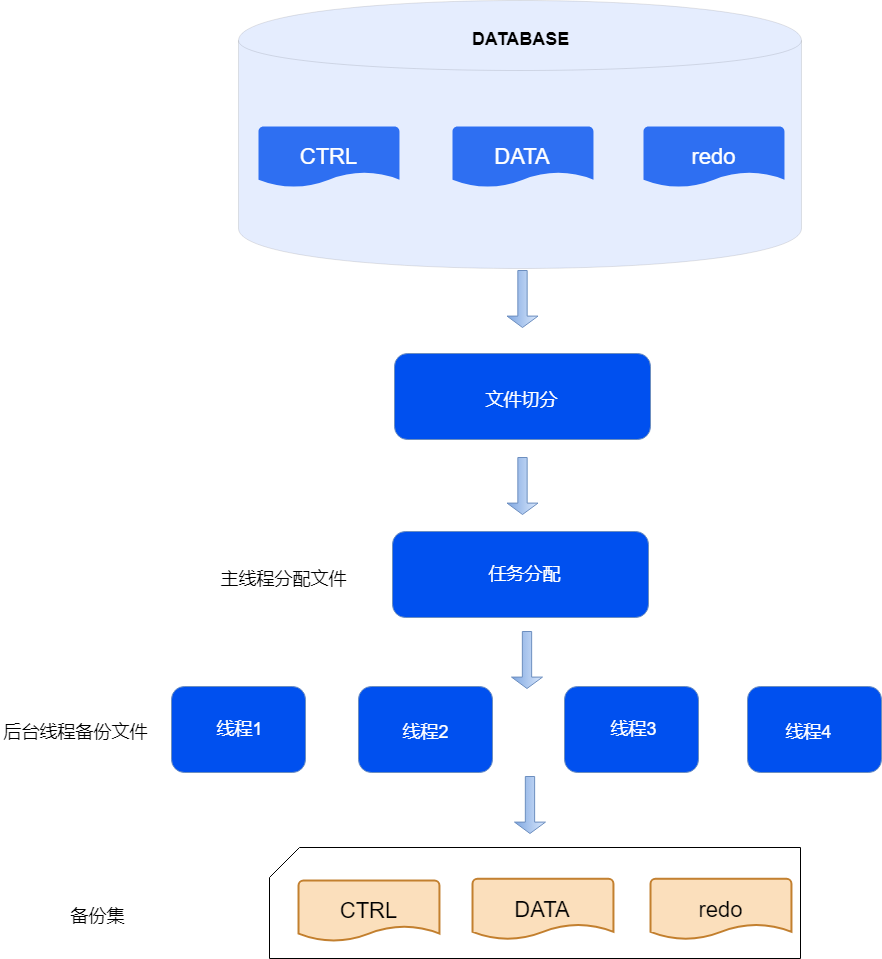
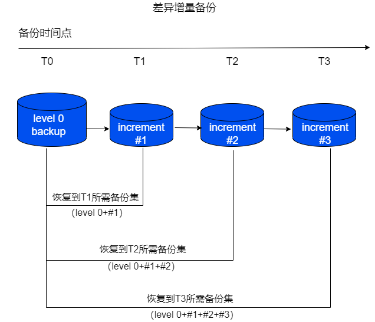
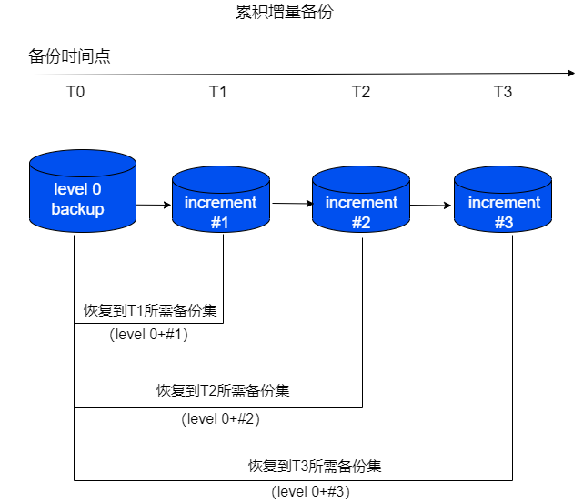
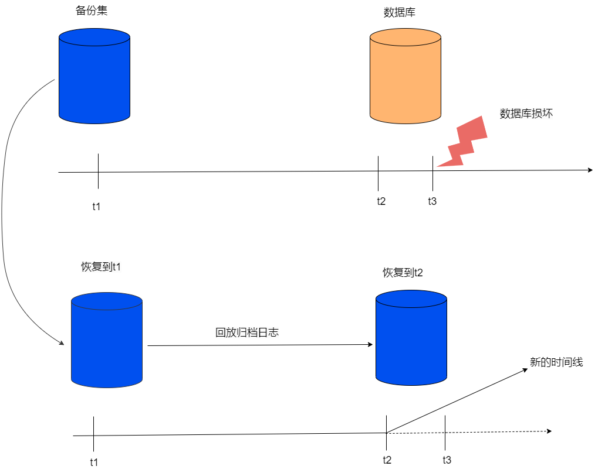

备份恢复是数据库损坏后常用的恢复措施。定期对数据库进行备份，当数据库遇到故障导致数据损坏时，可以使用合适的备份集恢复数据库，减少损失。

数据库备份分为物理备份和逻辑备份，物理备份（本文所提及的备份均为物理备份）直接将数据库物理文件拷贝为副本，逻辑备份将数据库对象按逻辑格式（例如SQL）导出到文件。

## 备份集

备份集是指对数据库执行备份操作后生成的若干文件集合。当备份介质为磁盘时，以文件夹的形式存在，用户可以自定义指定备份集名称和路径。一个备份集一定包含backup_profile文件（记录备份集元信息）、backup_filelist文件（备份集文件名列表）以及目标文件的备份文件（例如控制文件、数据文件、redo文件、slice文件等）。

目标文件生成备份文件的过程中，可能会进行切片、压缩、加密等操作，因此备份文件的大小以及个数与目标文件不一定相等。

备份集包含文件内容有如下所示：

- ctrl*.bak文件：数据库控制文件的备份。

- data*.bak文件：数据库所有数据文件的备份。

- arch*.bak文件：数据库归档日志文件的备份集合。

- redo*.bak文件：数据库redo文件备份集合，一般包含在备库执行备份生成的备份集内。

- bucket*.bak文件：slice文件的备份集合。

- backup_profile文件：备份集的元数据信息。

- backup_filelist文件：当前备份集中所有文件的校验信息。

## 备份粒度

### 全库备份

全库备份指整个数据库所有数据文件的拷贝（包括控制文件、数据文件、归档文件等）。

使用全库备份指令会将所有数据库文件拷贝至指定位置，生成独立的全库备份集，该备份集为全库备份。

使用全库备份集可将数据库恢复出与原始数据库数据完全一致的全新数据库。

在备份时，主线程会将数据文件切片，分配给不同的子线程，由子线程将文件分片拷贝为备份文件。

分布式数据库的全库备份需要备份MN的主库、所有CN和所有DN组的主库。备份分为两个阶段，第一阶段，所有目标节点备份控制文件和数据文件。第二阶段，在所有目标节点上获取一致性的redo日志点，然后备份一致性redo日志点之前的归档日志文件。在恢复分布式备份集时，所有节点只回放redo到备份时记录的一致性点，可以保证恢复后分布式事务的一致性。

### 归档备份

归档备份是针对目标数据库当前已存在的归档文件执行的备份操作，由用户指定归档日志文件的备份范围（可指定SEQUENCE、SCN、TIME或ALL范围模式），将指定范围内的归档文件拷贝至目标位置，以集合的形式存在。

在一个归档备份集里，包含的归档日志在每个实例上是连续的，不会存在空洞。

归档备份集可以用于基于时间点的恢复。

## 备份方式

### 全量备份

全量备份是指将备份目标的文件完全拷贝，全量备份生成的备份集包含完整的数据文件，可以单独用于恢复。

在全量备份时指定全库备份，则是将所有的数据库文件完全拷贝生成全库备份集。

### 增量备份

增量备份指只备份某一次备份后发生过修改的数据页面。增量备份可以减少备份集占用的空间，但增量备份集不能单独用于恢复，需要先恢复其依赖的基线备份集，基线备份集是指增量备份时作为基线的某个历史增量备份集。

增量备份集分为如下两个级别：

- LEVEL 0：首次增量备份必须为LEVEL 0。其增量备份集内容和全量备份集一样，是对数据文件的完整备份，占用空间较大。

- LEVEL 1：其增量备份集只备份基线备份集之后发生过修改的数据页面，占用空间较小。

增量备份根据基线备份集选择方式，分为差异增量备份和累积增量备份。

- **差异增量备份**

    差异增量备份是以最近一次LEVEL 0或LEVEL 1的增量备份集作为基线备份集。每个差异增量备份集中的数据页面不会重复，备份集占用空间小。
    
    恢复备份集时，需要将依赖的所有增量备份集依次恢复，恢复时间较长。

    

- **累积增量备份**

    累积增量备份是以最近一次LEVEL 0的增量备份集作为基线备份集。下一次的累积增量备份，会包含上一次累积增量备份的所有数据页面，因此累积增量备份的空间占用会随着备份次数的增加而增加。
    
    恢复备份集时，只需要先恢复LEVEL 0对应的增量备份集和当前最新的累积增量备份集。

    

## 备份目的地

### 本地备份

本地备份是指备份集存储在执行实例服务器本地磁盘，或执行实例可访问的共享存储上。

### 流式备份

流式备份（又称远程备份）是指通过网络将备份数据发送到远程服务器，在远程服务器上保存备份集。

流式备份需要使用yasrman工具，备份集会保存在yasrman工具所在的服务器。同时，yasrman支持基于XBSA协议的流式备份。

## 恢复

### 完整恢复

将全库备份集中的备份文件，解压、解密恢复到数据库目录，然后回放备份集中的归档日志将数据库恢复到一致性状态，可将数据库完整恢复到备份时刻。

对于全量备份集，直接从该备份集中恢复所有文件，包括控制文件、数据文件、归档日志。

对于增量备份集，首先恢复LEVEL 0的备份集中的数据文件，然后依次用后续的LEVEL 1备份集中的页面覆盖数据库的页面，最后用当前增量备份集的归档日志，回放数据库到一致性状态。

### 归档恢复

将归档备份集里的文件恢复到数据库的归档目录并注册到数据库中，其前提是数据库已从全库备份集恢复，再使用归档恢复补充全库备份集中不包含的归档日志，使数据库恢复更多的数据。

### 基于时间点的恢复（PITR）

备份集只能将数据库恢复到备份时间点，如果备份时间点之后的归档日志文件存在（或归档日志已经备份），则可以通过回放这些归档文件，让数据库恢复到任意时间点，此方式称为基于时间点的恢复(Point-in-Time Recovery)。

基于时间点的恢复允许数据库恢复到备份时间点至最新时间点间的任意时间，可以用来回退误操作或修复损坏的数据库。

如图所示，在t1时间点执行数据库的全库或增量备份，假设在数据库运行至t3时间点后发生数据库损坏，此时可以使用t1时间点的备份集和t1至t2时间点之间的归档文件，使用PITR操作回放归档日志至t2时间点，实现修复数据库异常损坏的目的。
